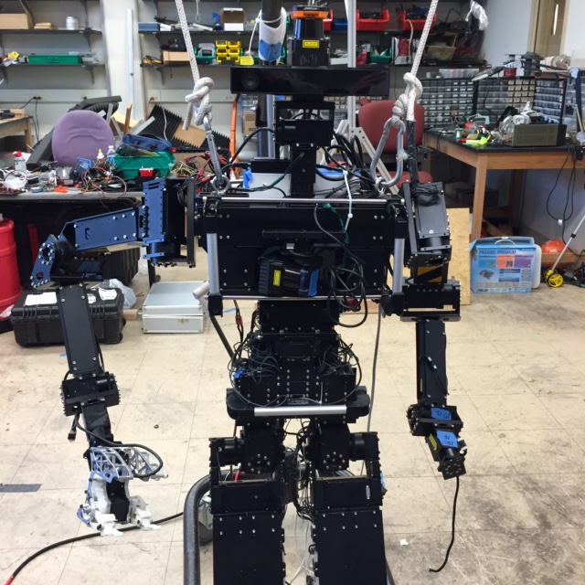
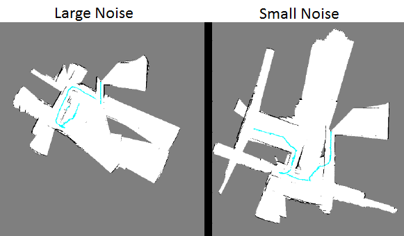
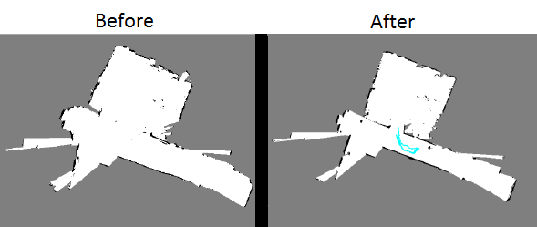
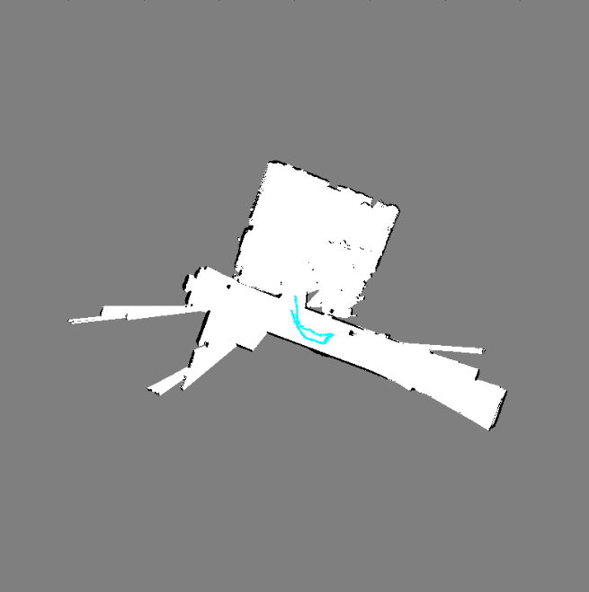
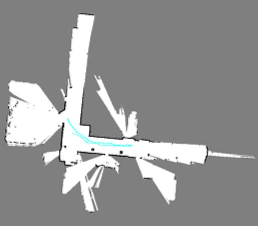
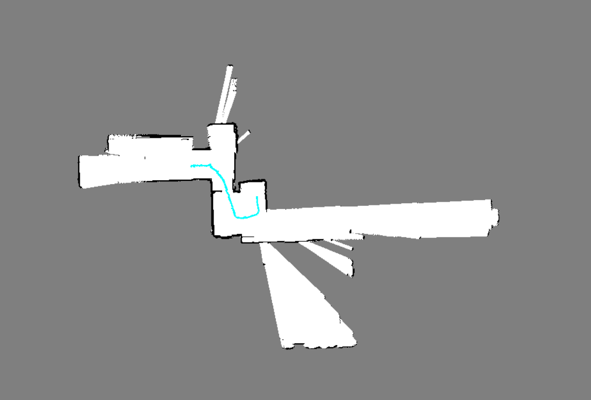
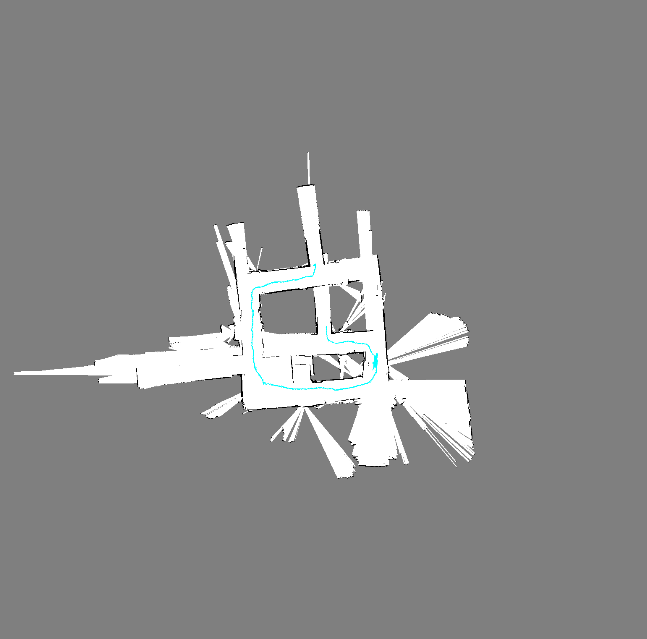

# Particle Filter SLAM
In this project, the structure of mapping and localization in an indoor environment is implemented using information from an IMU and range sensors. The IMU orientation and odometry information from a walking humanoid is integrated with a 2D laser range scanner (LIDAR) in order to build a 2D occupancy grid map of the walls and obstacles in the environment. SLAM was implemented using Particle Filters. After this, additional camera and depth imagery from a Kinect One sensor is integrated to build a textured map. Training sets of odometry, inertial, and range measurements are provided from a THOR‐OP humanoid robot.

* Tested on: Kubuntu 16.04.3, Intel i5-4200U (4) @ 2.600GHz 4GB
* Python 2.7, OpenCV 3.2

### THOR

### Texture Map Data (Optional)
* After cloning the repo, download from link -> [Drive](https://goo.gl/9xFu6J)
* Save to `Proj4_2018_Train_rgb`

Challenge Description
---------------------
* Preprocess LIDAR data
* Convert the Lidar scan data into proper cell position in the global world frame to create map
* Localization prediction step
* Localization update step
* Mapping the environment
* Texture Mapping

# Implementation Hacks
There are 2 main performance improvement tricks that I used to improve the outcome of the SLAM:

* Adding noise to the pose information appropriately: larger noise causes large gaps in the path, whereas smaller noise causes frequent change in direction. 

* Adding random positions to each particle during the calculation of correlation value, and select maximum value of particle as new updated position: accurate mapping.

# Results

### Test results
 
 

### Test results

# References
* [Robust Monte Carlo Localization for Mobile Robots](http://robots.stanford.edu/papers/thrun.robust-mcl.pdf)
* [Learning Occupancy Grid Maps with Forward Sensor Models](http://robots.stanford.edu/papers/thrun.iros01-occmap.pdf)
* [Head Tracking for the Oculus Rift](https://ieeexplore.ieee.org/abstract/document/6906608)
